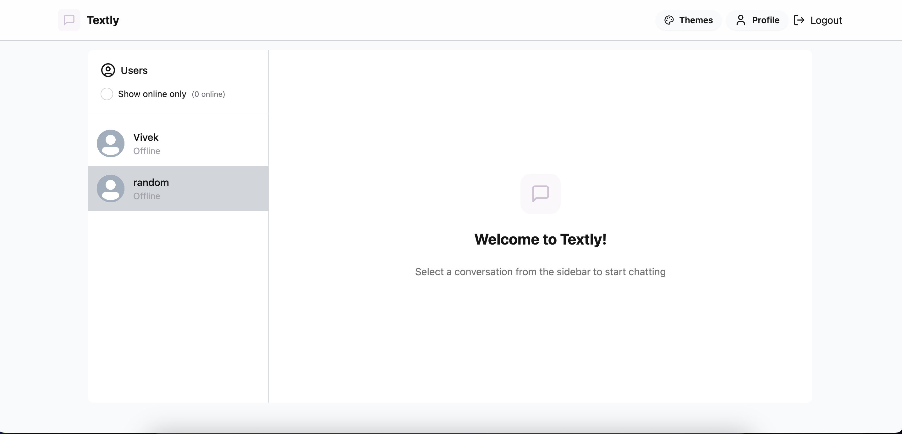

# Textly - Realtime Chat Application



## Tech Stack

### Frontend:

- **React**: For building a responsive and interactive user interface.
- **Zustand**: For state management.
- **CSS Framework**: Tailwind CSS, DaisyUI and Lucid-React.

### Backend:

- **Node.js/Express**: For handling server-side logic.
- **Socket.IO**: For real-time communication.
- **RESTful API**: For user authentication and chat management.

### Database:

- **MongoDB**: For storing user and chat data.

### Setup .env file

```js
MONGODB_URI = PORT = 5001;
JWT_SECRET =
  CLOUDINARY_CLOUD_NAME =
  CLOUDINARY_API_KEY =
  CLOUDINARY_API_SECRET =
  NODE_ENV =
    development;
```

### Steps:

1. Clone the repository:

   ```bash
    git clone https://github.com/Volatile-Viv/textly
   ```

2. Install Dependencies:

   ```bash
   cd textly
   cd frontend
   npm install
   cd ../backend
   npm install
   ```

3. Run the backend server:

   ```bash
   npm run dev
   ```

4. Run the frontend server:

   ```bash
   cd ../frontend
   npm run dev
   ```

## Contributing

Contributions to Textly are welcome! If you find any bugs or have suggestions for new features, please open an issue or submit a pull request. Before contributing, please review the contribution guidelines.

## License

This project is licensed under the MIT License.

For questions or inquiries about Textly, please contact creatorvivek18@gmail.com.
